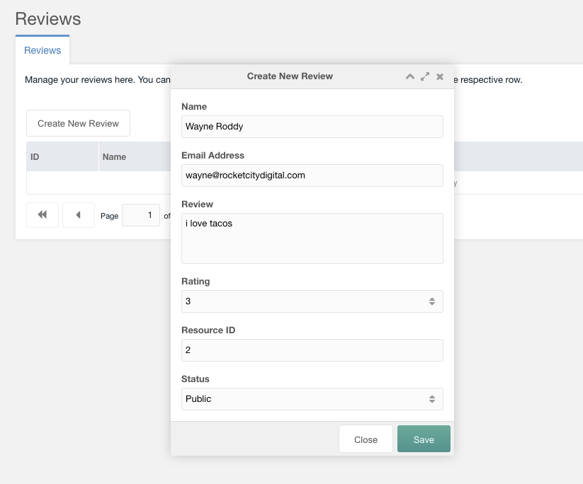
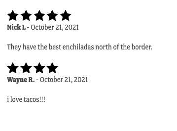

# Rocket Reviews

> A MODX "Reviews" Extra

 - Keep your business review data, don't be a hostage to 3rd party vendors
 - Reviews are not public until approved
 - Adjust Template chunk via Snippet Properties
 - Gather emails for marketing
 - Reward Reviewers with discounts, coupons, etc
 - Snippet output is all reviews or by Resource ID

## Download the latest package and upload via Manager install

```
  [[Reviews]]
```

```
  [[Reviews? &id=`[[*id]]`]]
```

```
  [[Reviews? &id=`[[*id]]` &limit=`3`]]
```

### Render a FormIt Form to save a reviews

```
  [[$rr-form]]
```

The form inputs include Bootstrap ready classes, and is run through a hook.

---




